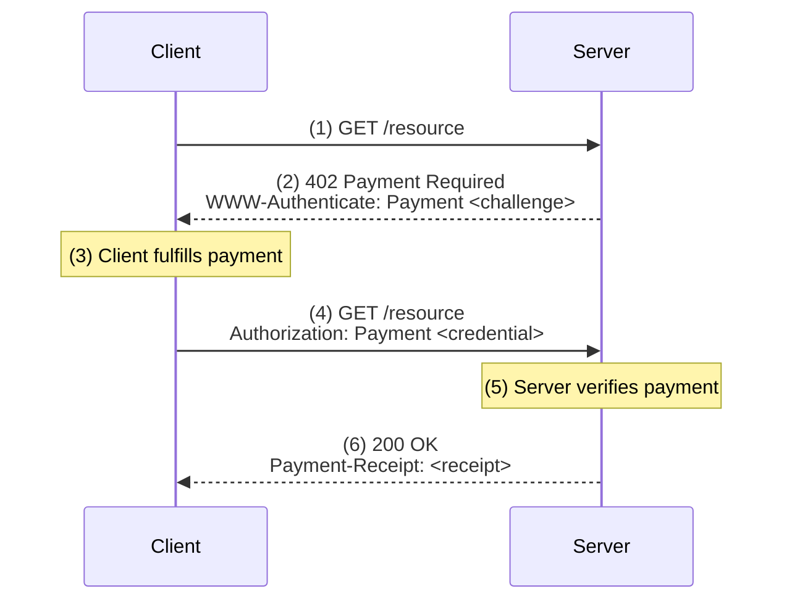

import { Card, Cards } from 'vocs'
import { Badge } from '../components/Badge'

# Machine Payments Protocol [The internet native payments protocol]

## Overview

The Machine Payments Protocol (MPP) lets you accept payments from any client—humans, software, or AI agents—using standard HTTP control flows. Clients pay inline with their request, and you receive payment confirmation before delivering the response.

MPP is built around a simple core and is designed to be neutral and extensible from day one.

- **Open standard built for the internet** — Built on an IETF-track specification, not a proprietary API
- **Designed for payments** — Idempotency, security, and receipts as first-class primitives
- **Multi rail** — Crypto, cards, bank transfers, invoices—all through one protocol
- **Multi currency** — USD, EUR, BRL, USDC, ETH, BTC, or any other asset
- **Client agnostic** — Humans, software, and AI agents have simple and safe ways to pay 

## Payment flow

When a client requests a paid resource, the server returns a `402` response with payment options. The client fulfills the payment and retries with a credential. The server verifies the payment and returns the resource with a receipt.

1. **Client requests resource** — `GET /resource`
2. **Server returns payment challenge** — `402` Payment Required with `WWW-Authenticate: Payment` header
3. **Client fulfills payment** — Signs a transaction, pays an invoice, or completes a card payment
4. **Client retries with credential** — `GET /resource` with `Authorization: Payment` header
5. **Server verifies and delivers** — `200` OK with `Payment-Receipt` header

## Use cases

* **Paid APIs** — Accept payments inline without requiring API keys, billing accounts, or manual signup. Clients pay per request.
* **MCP servers** — Monetize tool calls served through the Model Context Protocol. Agents pay autonomously without OAuth or account setup.
* **Content** — Monetize articles, data, or media without subscription paywalls. Charge per access or per query.

## Get started

`mpay` is the official SDK of the Machine Payments Protocol.

The MPP SDKs handle challenge parsing, payment method selection, and credential generation automatically across payment methods.

| Language | Package | GitHub | Maintainer | Status |
|----------|---------|--------|------------|--------|
| [TypeScript](/sdk/typescript) | [`mpay`](https://www.npmjs.com/package/mpay) | [wevm/mpay](https://github.com/wevm/mpay) | [wevm](https://github.com/wevm) | <Badge variant="info">Reference</Badge> |
| [Python](/sdk/python) | [`pympay`](https://pypi.org/project/pympay/) | [tempoxyz/pympay](https://github.com/tempoxyz/pympay) | [Tempo Labs](https://github.com/tempoxyz) | <Badge variant="default">Beta</Badge> |
| [Rust](/sdk/rust) | [`mpay`](https://crates.io/crates/mpay) | [tempoxyz/mpay-rs](https://github.com/tempoxyz/mpay-rs) | [Tempo Labs](https://github.com/tempoxyz) | <Badge variant="default">Beta</Badge> |

## Next steps

<Cards>
  <Card
    description="Build your first payment-enabled API in 5 minutes"
    icon="lucide:rocket"
    title="Quickstart"
    to="/quickstart"
  />
  <Card
    description="Learn about challenges, credentials, and receipts"
    icon="lucide:book-open"
    title="Protocol concepts"
    to="/protocol"
  />
  <Card
    description="Read the IETF-track specification"
    icon="lucide:file-text"
    title="Specification"
    to="https://paymentauth.tempo.xyz"
  />
</Cards>
